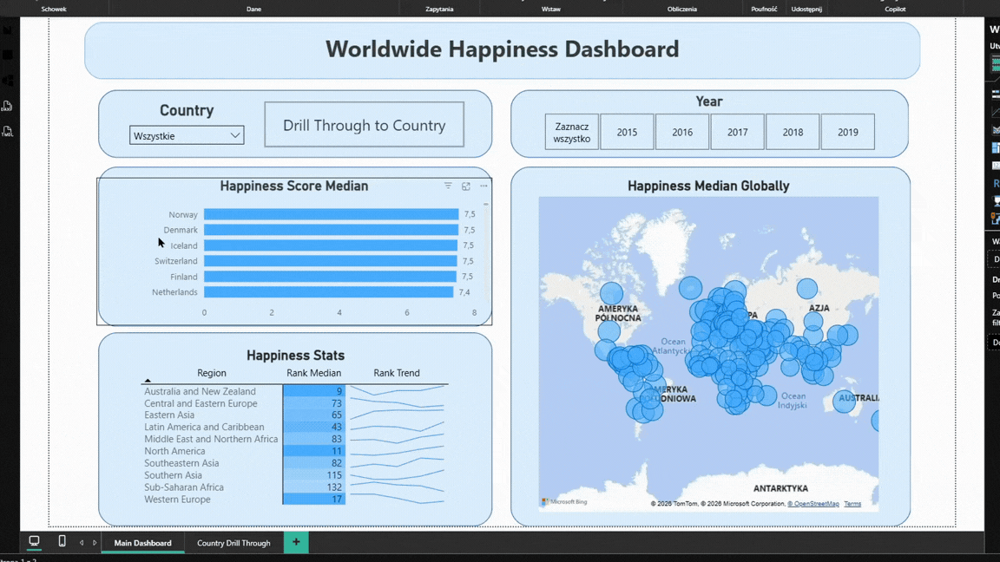

# 📊 Power BI Worldwide Happiness Dashboard

## 📚 Table of Contents
- **Introduction**
- **Data Overview**
- **Structure Explanation**
- **Dashboard Overview**
- **Skills Used**
- **Data Source**
- **Author**

## 🔎 Introduction

This project provides a possibility to explore happiness scores in countries around the world using a Power BI dashboard. 

## 📂 Data Overview

There are five different CSV files one for each from 2015 to 2019. They include country names, happiness ranks and scores as well as scores from different studies.

**Data Cleanup:** Before the analysis, I cleaned the data using Power Query by manipulating columns, changing data types, rounding decimal places.

## 🧱 Structure Explanation

| Folder / File | Description |
|----------------|-------------|
| **data/** | Contains original data files |
| **images/** | Includes dashboard GIF file and screenshots of Power Query skills used in the project |
| **Worldwide-Happiness-Dashboard.pbix** | Main project file |
| **README.md** | Project overview |

## 📊 Dashboard Overview

This report is split into two distinct pages to provide both a high-level summary and a detailed analysis.

### Main Dashboard

This page allows you to explore the median happiness score for different countries and happiness stats for different regions. You can filter the data by country and year (multiple choice is included).

### Country Drill Through

From the main dashboard, you can drill through to this view to get details for a specific country data, including country rank over the years and median scores for family, health, economy, generosity, freedom and trust (government corruption). You can filter the data by year (multiple choice is included).

## 💪 Skills Used

### Power Query skills: 
   - Merging and Appending Queries
   - Adding Index Columns
   - Changing Data Types
   - Value Replacement 

To view PQ skills used in this repo, go to the *images/power_query_skills* folder.

### Power BI skills (other than Power Query):
   - Bar, Line, Column and Map Charts
   - Establishing Relationships
   - Matrix
   - Cards and Gauge Cards
   - Slicers
   - Buttons
   - Changing Interactions

## 🔗 Data Source

[Kaggle World Happiness Report](https://www.kaggle.com/datasets/unsdsn/world-happiness) 

## ✒️ Author

- **Author:** Mateusz Bochenek
- **Mail:** matbochenek42@gmail.com
- **GitHub link:** https://github.com/matbochenek42
- **LeetCode link:** https://leetcode.com/u/SmO7BWmsiz/